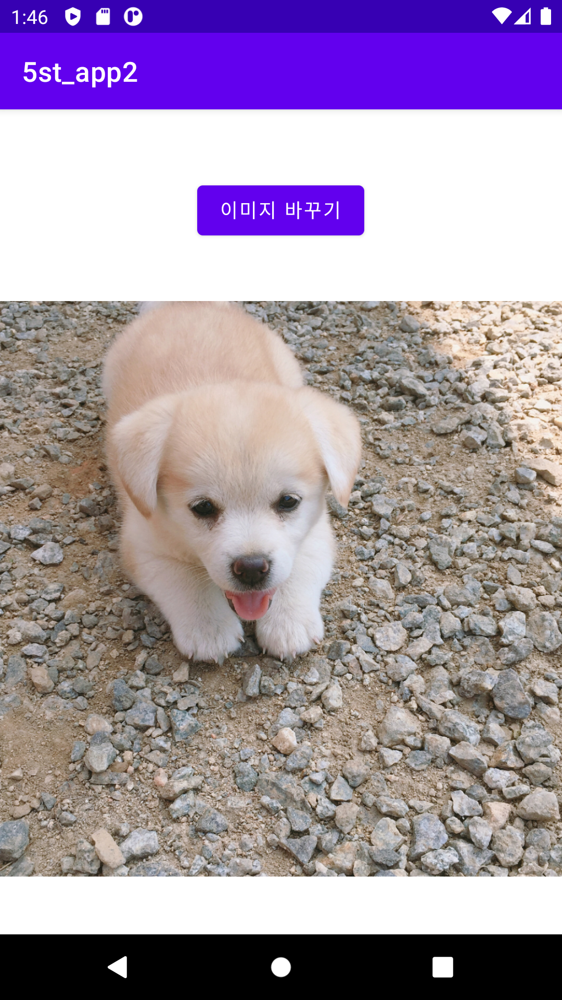
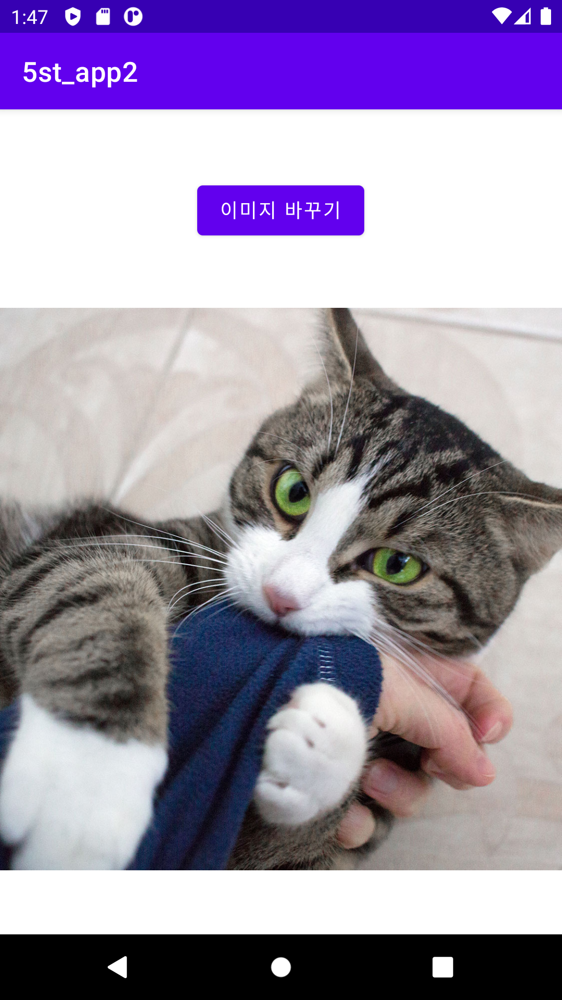
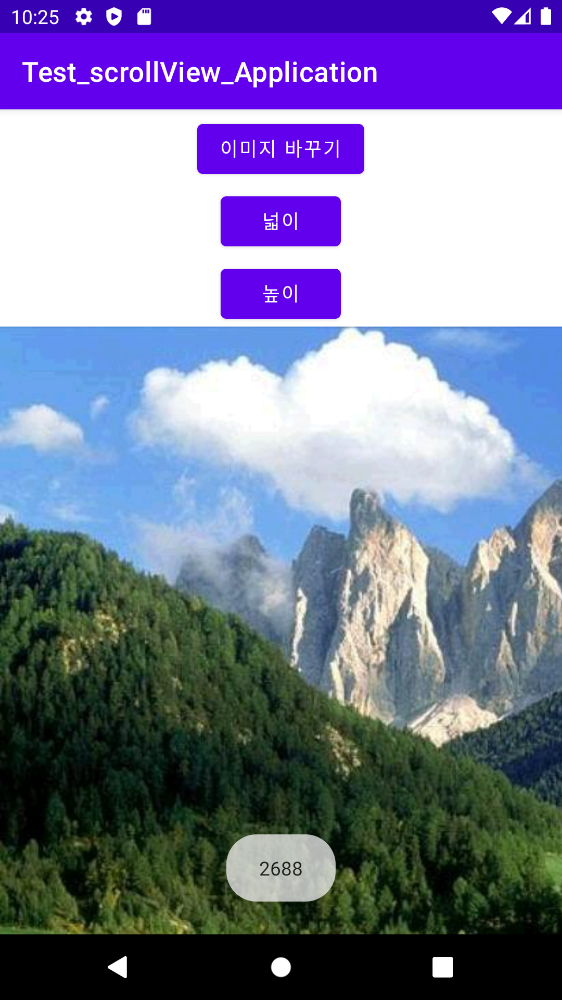
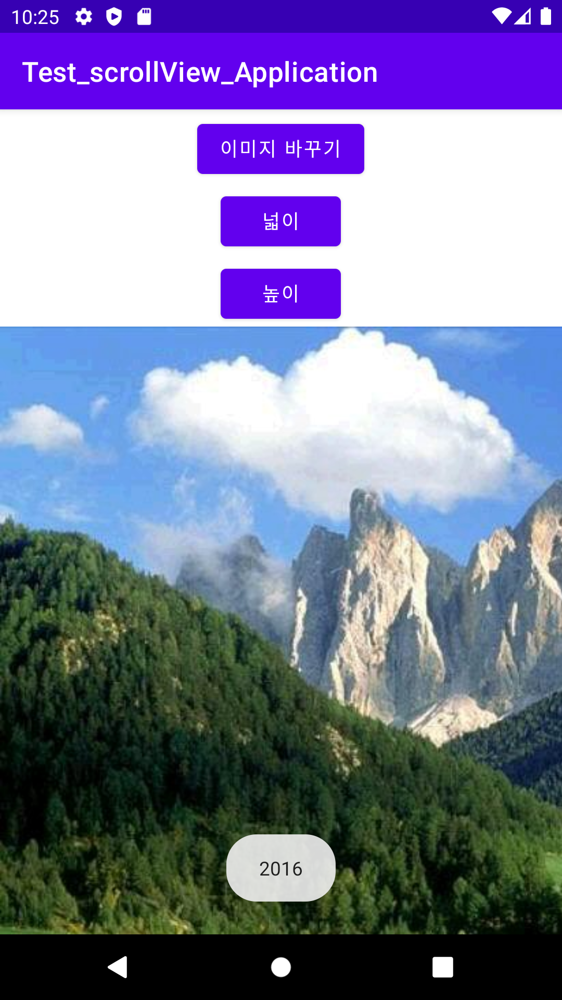

# 20273021 김채현

## 2주차  수업
  - Github사용방법
  - 안드로이드앱프로그래밍
  - 앱기획

</img>

## 3주차 과제
</img>
</img>

## 4주차 과제
음식점 대기인원 앱
: 음식점 매장에서 몇 명이 주문하고 기다리고 있는지 알 수 있고 대기시간도 알려주면 주문하는 데 있어서 편할 것입니다.
또한 미리 주문, 예약도 가능하다면 시간을 절약할 수 있을 것입니다.

## 5주차 과제
</img>
</img>

## 6주차 과제
</img>
</img>
